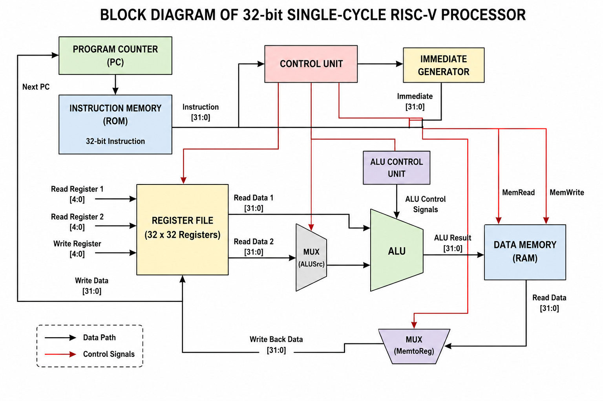
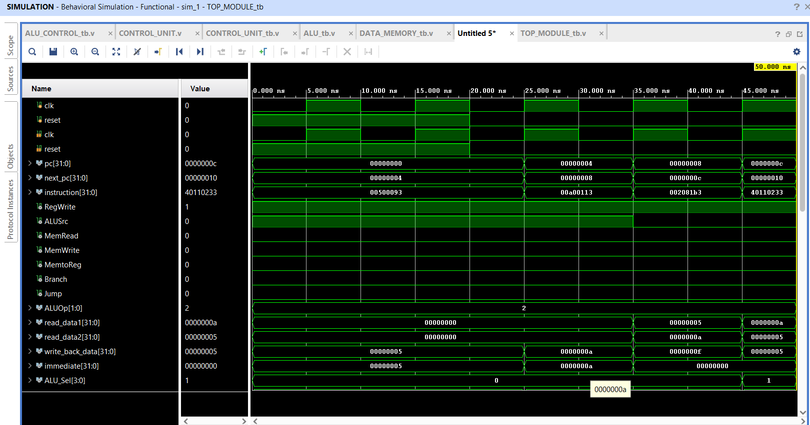
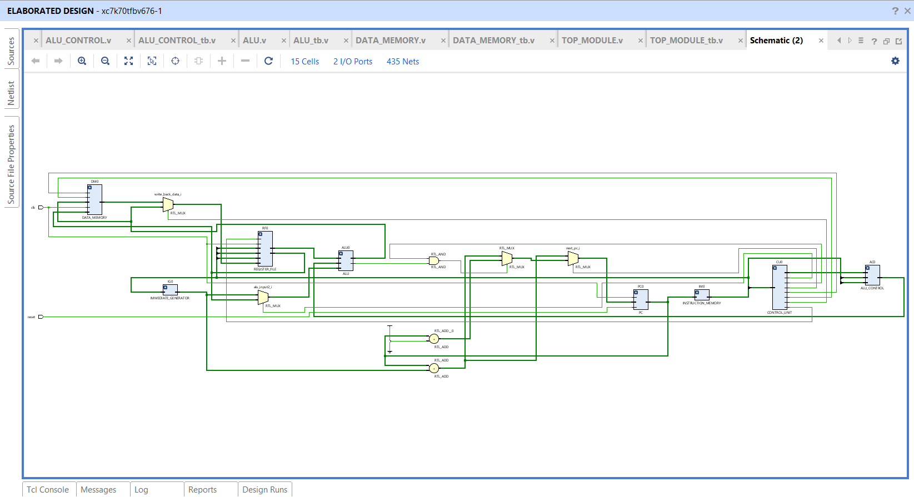

# 32-bit-Single-Cycle-RISC-V-Processor
Design and Simulation of a 32-bit Single-Cycle RISC-V Processor using Verilog HDL

# 32-bit Single-Cycle RISC-V Processor using Verilog HDL

## Project Overview

This project presents the design and simulation of a 32-bit Single-Cycle RISC-V Processor based on the RV32I Instruction Set Architecture (ISA). The processor is designed using Verilog HDL with a modular architecture and functionally verified using AMD Xilinx Vivado 2025.2.

## Objectives

- To design a 32-bit RISC-V processor using Verilog HDL.
- To implement the basic RV32I instruction set.
- To design and integrate the major processor modules.
- To verify each module using simulation.
- To verify the complete processor using behavioral simulation.
- To analyze the RTL schematic of the processor.

## Processor Architecture

The processor consists of the following major modules:

- Program Counter (PC)
- Instruction Memory
- Register File
- Immediate Generator
- Control Unit
- ALU Control Unit
- Arithmetic Logic Unit (ALU)
- Data Memory
- Top Module

## Block Diagram

The block diagram shows the connection and data flow between the major components of the 32-bit Single-Cycle RISC-V Processor.

## Working Principle

The Program Counter provides the address of the current instruction. The Instruction Memory provides the corresponding instruction, which is decoded by the Control Unit. The Register File provides the required operands, while the Immediate Generator generates immediate values when required.

The ALU performs arithmetic and logical operations based on the control signals generated by the ALU Control Unit. Data Memory is accessed for load and store operations. The final result is written back to the Register File, and the Program Counter is updated for the next instruction.

## Technologies Used

- Verilog HDL
- AMD Xilinx Vivado 2025.2
- Vivado Simulator (XSim)
- RV32I RISC-V ISA

## Source Code

The complete Verilog source code is available in the `Verilog_Source` folder.

## Testbenches

Individual and complete processor testbench files are available in the `Testbenches` folder.

## Simulation Results

Behavioral simulation waveforms for the processor modules are available in the `Simulation_Results` folder.

## RTL Schematic

The RTL schematic generated using AMD Xilinx Vivado 2025.2 is available in the `RTL_Schematic` folder.

## Project Documentation

The project report and poster are available in the `Documentation` folder.

## Future Scope

- Implementation of a pipelined RISC-V processor.
- Addition of instruction and data cache memory.
- Support for additional RISC-V extensions.
- Interrupt and exception handling.
- FPGA hardware implementation.
- Performance optimization.

## Author

**Rajendra Naik**

B.E. Electronics and Communication Engineering  
University B.D.T. College of Engineering, Davanagere  
VTU

## License

This project is developed for educational and academic purposes.
